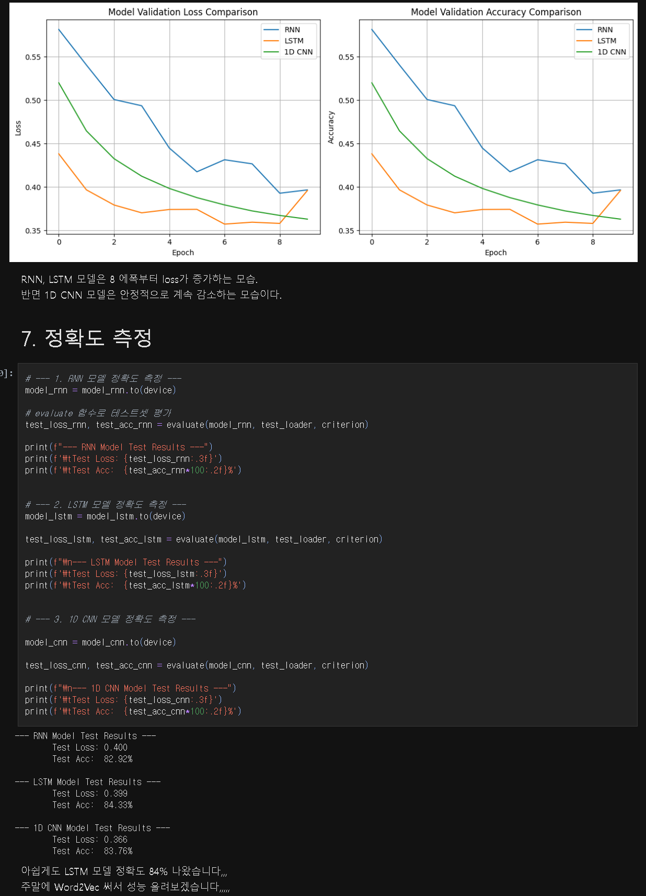
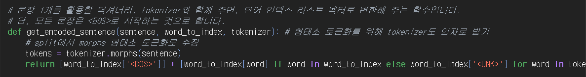
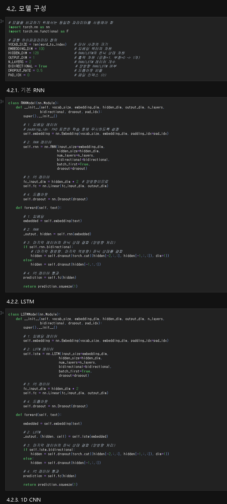

# AIFFEL Campus Online Code Peer Review Templete
- 코더 : 최원진
- 리뷰어 : 신재욱


# PRT(Peer Review Template)
- [x]  **1. 주어진 문제를 해결하는 완성된 코드가 제출되었나요?**
    - 문제에서 요구하는 최종 결과물이 첨부되었는지 확인
        - 중요! 해당 조건을 만족하는 부분을 캡쳐해 근거로 첨부
<br>
word2vec 적용 결과가 빠졌긴 하지만 주요 코드는 다 완성되었고, 결과도 첨부되어 있음<br>
    
- [x]  **2. 전체 코드에서 가장 핵심적이거나 가장 복잡하고 이해하기 어려운 부분에 작성된 
주석 또는 doc string을 보고 해당 코드가 잘 이해되었나요?**
    - 해당 코드 블럭을 왜 핵심적이라고 생각하는지 확인
    - 해당 코드 블럭에 doc string/annotation이 달려 있는지 확인
    - 해당 코드의 기능, 존재 이유, 작동 원리 등을 기술했는지 확인
    - 주석을 보고 코드 이해가 잘 되었는지 확인
        - 중요! 잘 작성되었다고 생각되는 부분을 캡쳐해 근거로 첨부
<br>
lr가 작게 설정되어 있음에도 빠르게 loss가 줄었는데, 사전 데이터 처리에 차이가 있다고 봄<br>
그 중에도 특히 토큰화를 수행하는데 단순 splite을 쓰지 않고,<br>
한글의 특성에 맞게 형태소 토큰화를 수행한것이 가장 큰 비중을 차지했다고 생각됨<br>

- [ ]  **3. 에러가 난 부분을 디버깅하여 문제를 해결한 기록을 남겼거나
새로운 시도 또는 추가 실험을 수행해봤나요?**
    - 문제 원인 및 해결 과정을 잘 기록하였는지 확인
    - 프로젝트 평가 기준에 더해 추가적으로 수행한 나만의 시도, 
    실험이 기록되어 있는지 확인
        - 중요! 잘 작성되었다고 생각되는 부분을 캡쳐해 근거로 첨부
        
- [ ]  **4. 회고를 잘 작성했나요?**
    - 주어진 문제를 해결하는 완성된 코드 내지 프로젝트 결과물에 대해
    배운점과 아쉬운점, 느낀점 등이 기록되어 있는지 확인
    - 전체 코드 실행 플로우를 그래프로 그려서 이해를 돕고 있는지 확인
        - 중요! 잘 작성되었다고 생각되는 부분을 캡쳐해 근거로 첨부
        
- [x]  **5. 코드가 간결하고 효율적인가요?**
    - 파이썬 스타일 가이드 (PEP8) 를 준수하였는지 확인
    - 코드 중복을 최소화하고 범용적으로 사용할 수 있도록 함수화/모듈화했는지 확인
        - 중요! 잘 작성되었다고 생각되는 부분을 캡쳐해 근거로 첨부
<br>
코드는 알아보기 쉽게 셀단위로 잘 구분되어 있고 깔끔하게 작성되었음<br>

# 회고(참고 링크 및 코드 개선)
```
# 리뷰어의 회고를 작성합니다.
# 코드 리뷰 시 참고한 링크가 있다면 링크와 간략한 설명을 첨부합니다.
# 코드 리뷰를 통해 개선한 코드가 있다면 코드와 간략한 설명을 첨부합니다.

사전 데이터 처리가 인상 깊었다.<br>
필자와 비교했을 때, lr가 작음에도 상대적으로 큰 차이가 없거나 빠르게 loss가 줄었는데,<br>
다양한 사전 데이터 처리에 큰 차이를 볼 수 있었다.<br>
역시 모델이 잘 만들어져도 사전 데이터 처리는 쉽게 보고 넘어갈 것이 아닌것 같다.<br>
```
