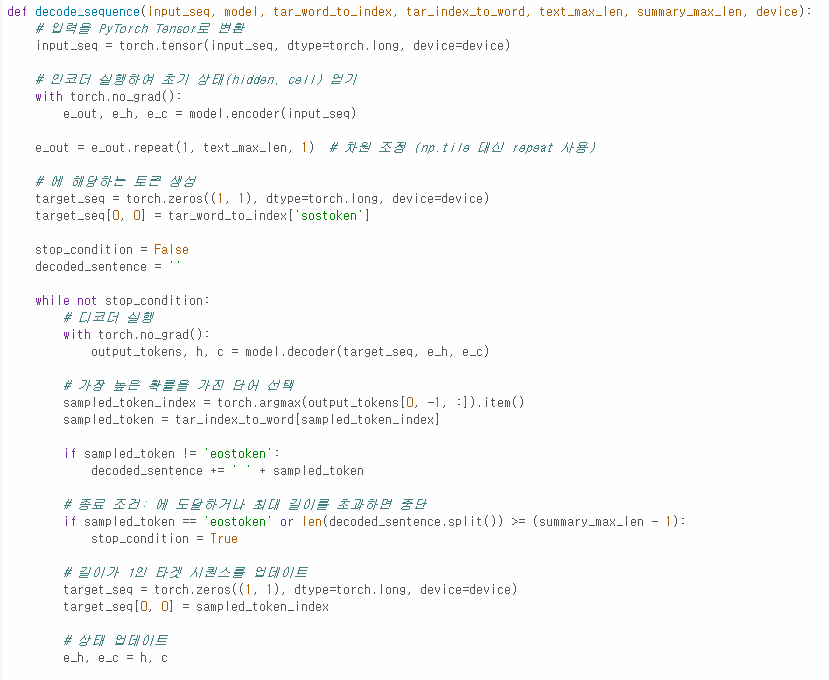
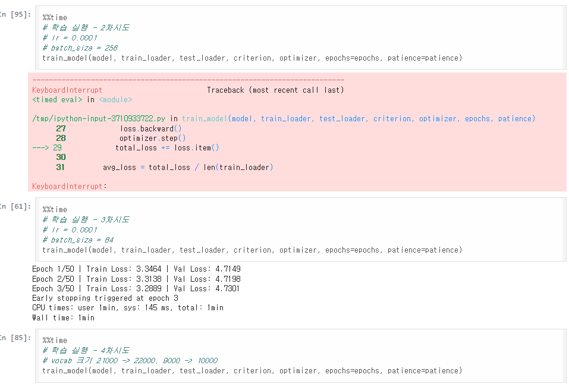
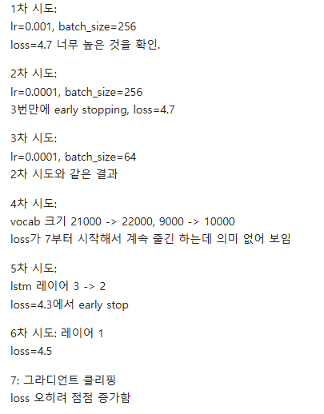
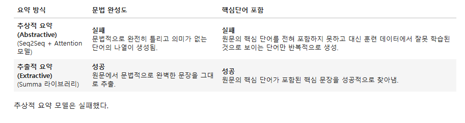

# README (최원진님)

# AIFFEL Campus Online Code Peer Review Templete

- 코더 : 최원진
- 리뷰어 : 임보혁

# PRT(Peer Review Template)

- [x]  **1. 주어진 문제를 해결하는 완성된 코드가 제출되었나요?**
    - Abstractive 모델 구성을 위한 텍스트 전처리 단계가 체계적으로 진행되었다.
    - 모델 학습이 진행되면서 train loss와 validation loss가 감소하는 경향을 그래프를 통해 확인하였다.
    - Extractive 요약을 시도해 보고 Abstractive 요약 결과과 함께 비교
    - 다만, 실제 요약문에 있는 핵심 단어들이 요약 문장 안에 포함**되지는 않았다.**
    
- [x]  **2. 전체 코드에서 가장 핵심적이거나 가장 복잡하고 이해하기 어려운 부분에 작성된
주석 또는 doc string을 보고 해당 코드가 잘 이해되었나요?**
    - **untrained 된 encoder / decoder를 호출하지 않고, trained 된 모델 호출**
        
        
        
    
- [x]  **3. 에러가 난 부분을 디버깅하여 문제를 해결한 기록을 남겼거나
새로운 시도 또는 추가 실험을 수행해봤나요?**
    - 하이퍼 파라미터, 파라미터를 수정하면서 validation loss를 줄이려 노력하였다.
        
        
        
        
        
    
- [x]  **4. 회고를 잘 작성했나요?**
    
    
    
- [x]  **5. 코드가 간결하고 효율적인가요?**
    - 모두 만족하였다.

# 회고(참고 링크 및 코드 개선)

```
추론부분의 정확도를 올리기 위해 노력한 흔적이 많이 보이는 것 같습니다.

```